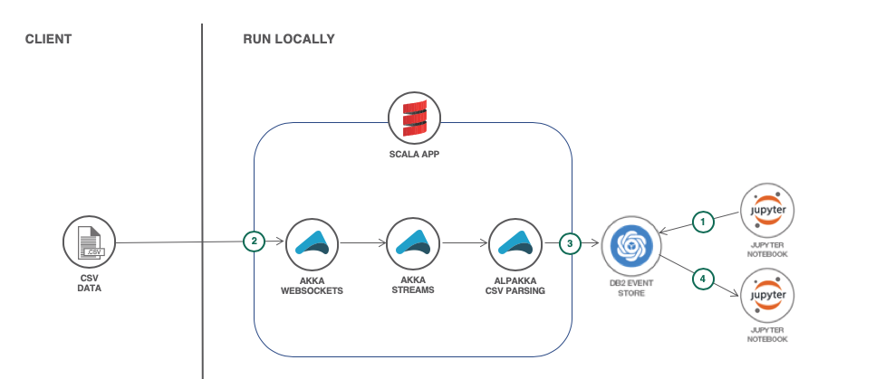
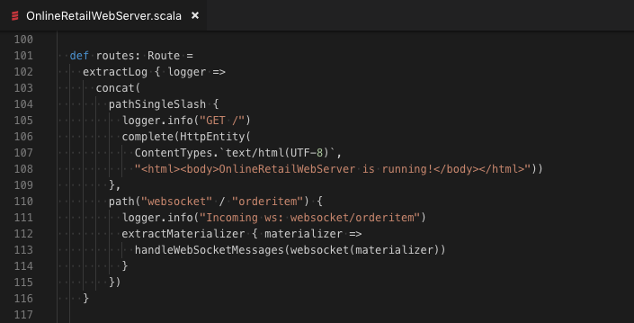
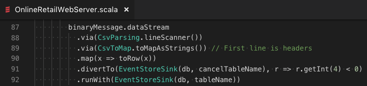
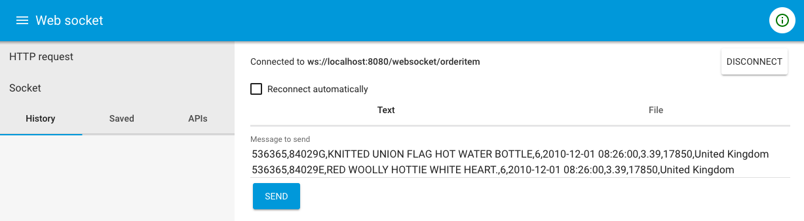
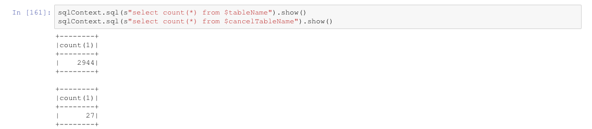
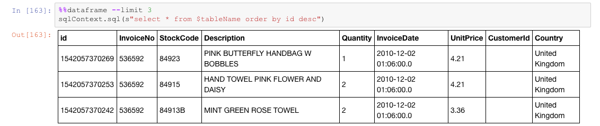
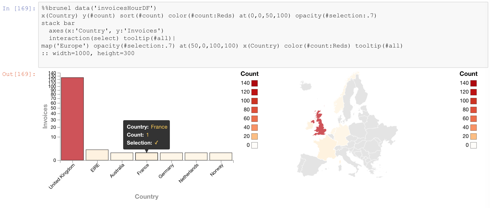
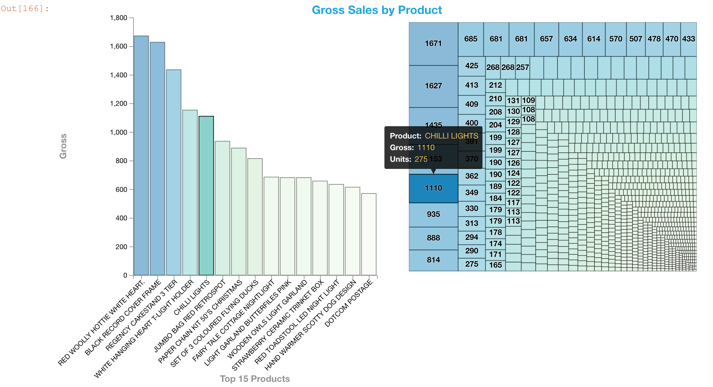

[](https://travis-ci.org/IBM/db2-event-store-akka-streams)

# Online retail data streaming with Akka and Db2 Event Store

In this code pattern, we will build a Scala app that uses Akka to
implement a WebSockets endpoint which streams data to a Db2 Event Store
database. For our data, we'll use online retail order details in CSV format.
We'll use Jupyter notebooks with Scala and Brunel to visualize the Event Store data.

When the reader has completed this Code Pattern, they will understand how to:

* Implement WebSockets with Scala and Akka
* Use Alpakka Flows for CSV parsing and inserts into Event Store
* Use Jupyter notebooks and Scala to interact with Event Store
* Use Spark SQL and Brunel visualizations to analyze the data



## Flow

1. Setup the database with a Jupyter notebook.
2. Submit CSV data via WebSockets.
3. Use Akka and Alpakka to transform the data and feed it into Event Store.
4. Present the data with Brunel visualizations in a Jupyter notebook.

<!--
# Watch the Video
[](https://www.youtube.com/watch?v=Jxi7U7VOMYg)
-->

## Steps

1. [Clone the repo](#1-clone-the-repo)
1. [Install IBM Db2 Event Store Developer Edition](#2-install-ibm-db2-event-store-developer-edition)
1. [Run the database setup notebook](#3-run-the-database-setup-notebook)
1. [Run the Scala app](#4-run-the-scala-app)
1. [Feed in data](#5-feed-in-data)
1. [Visualize the data](#6-visualize-the-data)

### 1. Clone the repo

Clone the `db2-event-store-akka-streams` repo locally. In a terminal, run:

```bash
git clone https://github.com/IBM/db2-event-store-akka-streams
```

### 2. Install IBM Db2 Event Store Developer Edition

Install IBM® Db2® Event Store Developer Edition on Mac, Linux, or Windows by following the instructions [here.](https://www.ibm.com/support/knowledgecenter/en/SSGNPV/eventstore/desktop/install.html)

> Note: This code pattern was developed with EventStore-DeveloperEdition 1.1.4

### 3. Run the database setup notebook

The git repo includes a Jupyter notebook which is used to setup the database
for this code pattern. The notebook also demonstrates some basics of using
Scala with Event Store, such as:

* Create a database
* Create a table
* Query a table

#### Import the setup notebook

Use the Db2 Event Store UI to create and run the notebook.

1. From the  upper-left corner `☰` drop down menu, select `My Notebooks`.
1. Click on `add notebooks`.
1. Select the `From File` tab.
1. Provide a name.
1. Click `Choose File` and navigate to the `notebooks` directory in your cloned repo. Select the file `online_retail_database_setup.ipynb`.
1. Scroll down and click on `Create Notebook`.

The new notebook is now open and ready for execution.

#### Run the setup notebook

1. Edit the `host` constant in the first code cell. You will need to enter your host's IP address here.
2. Run the notebook using the menu `Cell  ▷ Run all` or run the cells individually with the play button.

### 4. Run the Scala app

The repo contains an sbt project to run the Scala/Akka app.

* Install sbt from [here](https://www.scala-sbt.org/1.0/docs/Setup.html).
* Run the app:

  ```bash
  cd db2-event-store-akka-streams
  sbt run
  ```

The app creates a WebSockets endpoint at `ws://localhost:8080/websocket/orderitem`.

Using Akka HTTP, very little code is needed to set up WebSockets. We also put a simple message at `/` for folks that hit server URL.



With Akka Streams and Alpakka, we have an elegant way to:

* Parse the CSV data
* Map the CSV data using headers
* Transform the data into Spark SQL Rows
* Divert negative quantity order items into our cancellations EventStoreSink
* Feed remaining orders into our EventStoreSink table `OnlineRetailOrderDetails`



> Note: EventStoreSink and EventStoreFlow are not currently part of the Alpakka distribution. They are provided in this code pattern's github repo.

### 5. Feed in data

Now that the app is running, data can be fed in with WebSockets.

For example data, use the file
[data/online_retail_2010_12.csv](data/online_retail_2010_12.csv)
from your cloned repo. This CSV file contains a header that is used for mapping the columns.
You can feed in one or more rows as CSV text (no header) or feed in an entire CSV file (with header).
Example header and order details:
```csv
InvoiceNo,StockCode,Description,Quantity,InvoiceDate,UnitPrice,CustomerID,Country
536365,85123A,WHITE HANGING HEART T-LIGHT HOLDER,6,2010-12-01 08:26:00,2.55,17850,United Kingdom
536365,71053,WHITE METAL LANTERN,6,2010-12-01 08:26:00,3.39,17850,United Kingdom
536365,84406B,CREAM CUPID HEARTS COAT HANGER,8,2010-12-01 08:26:00,2.75,17850,United Kingdom
```

You should be able to use your favorite WebSockets test client (or write one).
For example, **Advanced REST Client (ARC)** supports testing WebSockets with
text or file input.



#### To test with ARC

* Install ARC from [here](https://install.advancedrestclient.com/#/install).
* Run the ARC app.
* Select `Socket` in the left sidebar menu
  (if the menu is hidden use the upper-left corner `☰` drop down menu).
* Enter `ws://localhost:8080/websocket/orderitem` as the `Socket URL` and hit `CONNECT`.
* To send text:
  * Click on the `Text` tab.
  * Paste one more lines of text from the example CSV file into `Message to send`.
  * Press `SEND`.
* To send a file:
  * Click on the `File` tab.
  * Click `SELECT FILE` or use drag-and-drop to select an example CSV file.
  * Press `SEND`.
* Direction **out** will show when/what you sent, and direction **in** will show the response from your server.

### 6. Visualize the data

The git repo includes a Jupyter notebook which is uses Spark SQL and
Brunel visualizations to manipulate and present the data.

#### Import the orders notebook

Use the Db2 Event Store UI to create and run the notebook.

1. From the  upper-left corner `☰` drop down menu, select `My Notebooks`.
1. Click on `add notebooks`.
1. Select the `From File` tab.
1. Provide a name.
1. Click `Choose File` and navigate to the `notebooks` directory in your cloned repo. Select the file `online_retail_orders.ipynb`.
1. Scroll down and click on `Create Notebook`. The new notebook is now open and ready for execution.

#### Run the orders notebook

1. Edit the `host` constant in the first code cell. You will need to enter your host's IP address here.
2. Run the notebook using the menu `Cell  ▷ Run all` or run the cells individually with the play button.

#### Review the output

##### Counts and most recent events

Near the top of the notebook we use simple Spark SQL output to
help you verify that your data got into Event Store. As you feed
in data you can run these cells over and over if you'd like to
see the current count or your most recent events.




##### Aggregation and manipulation

Next we do some aggregation and manipulation.
For example, the notebook:

* Calculates gross sales (UnitPrice * Quantity)
* Uses number and date formatting
* Extracts hour-of-the-day from timestamps
* Aggregates the data using these calculated attributes
* Aggregates to get Invoice counts (multiple events per invoice)
* Uses various group-by summaries

##### Display the aggregated information

Spark SQL and %%dataframe cell magic makes it easy to show a nice table for Top-10 (by units or gross sales). Brunel makes it easy to show graphically with interactive charts and maps. Here are some examples:




Run the code pattern (or cheat and look at the sample output notebook)
to see these examples live -- and more.


## Sample output

See the notebook with example output and **interactive charts** [here](http://nbviewer.jupyter.org/github/IBM/db2-event-store-akka-streams/blob/master/data/examples/online_retail_orders.ipynb).

## License

[Apache 2.0](LICENSE)
